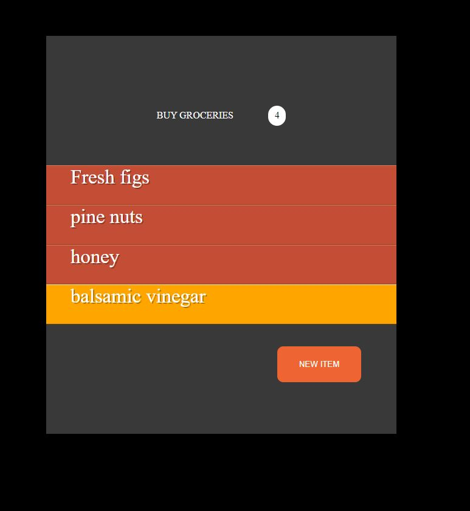
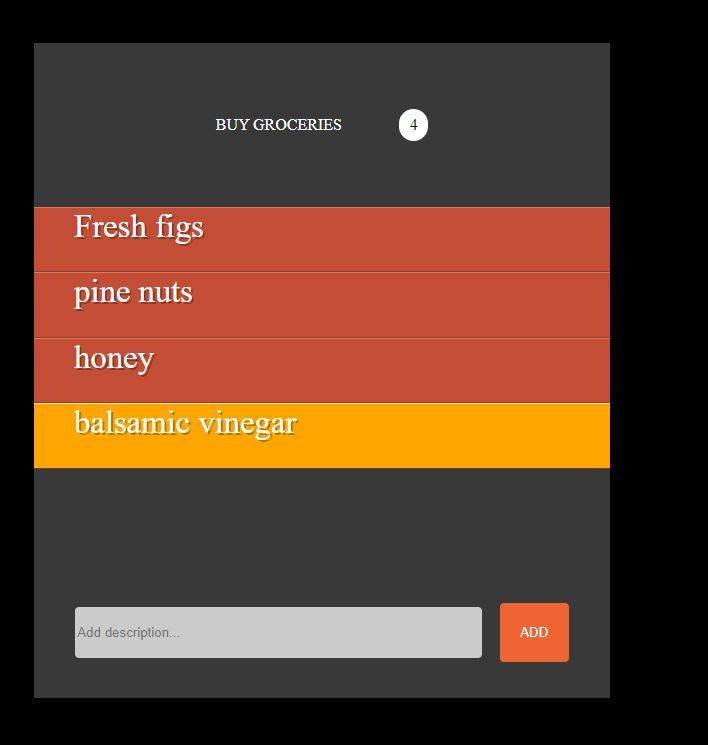
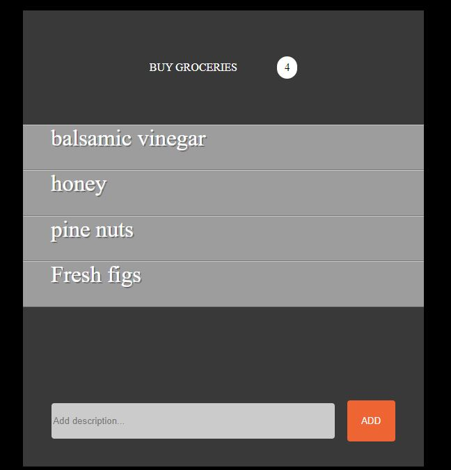

## <h1> 🖼 Add Groceries CheckList</h1>  
<h3  style="color:red;">Link to the Page Click Below<h3>
<a href="https://lewisc99.github.io/simple-project-buy-groceries-javascript-jquery-css/Index.html" target="_blank">Click Here</a>
 

<h2>Description English</h2>

 Simple Add Groceries to Checklist you can add a new Item and remove it.

<h2>Descrição Português</h2>

 Simples App para adicionar itens na compra e remove-los 

 
## 🚀 Tech Usada 
 
- Javascript 
- HTML and CSS 
- Jquery 
 

## 🖼 Screenshot APPLICATION SCREENS  

Whole application click below to the run video

 
 

Default Page

 
 

Add new Grocery

 
 

Remove Item

 
 

## Linkedin Below - Linkedin ABaixo

<h4 align="center">
   Created by   <a href="https://www.linkedin.com/in/luiz-carlos-b50693173/" target="_blank"> Luiz Carlos </a>
</h4>

</html>
